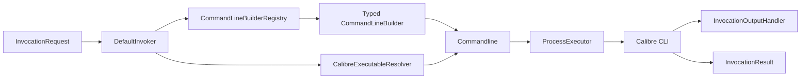

# calibre-invoker 完整功能实施计划

> 已改写为 Superpowers 规格与执行计划。本文件仅保留为历史需求输入；本次变更不再初始化 OpenSpec，唯一规格事实源为 `docs/superpowers/specs/2026-08-19-calibre-invoker-complete-functionality-design.md`，实施计划为 `docs/superpowers/plans/2026-08-19-calibre-invoker-complete-functionality.md`。

## 1. 目标与范围

目标是在保持现有公开 API 二进制兼容的前提下，将仓库中已经声明的 Calibre 请求类型全部接入统一执行入口，补全缺失的命令行构建、配置优先级、可执行文件解析、错误语义、日志、测试、CI 和文档，使项目从“仅 web2disk 纵向可用”提升为可发布的完整 Java 17 Calibre CLI 调用库。

本计划覆盖以下 10 个命令：

1. `ebook-convert`
2. `ebook-edit`
3. `ebook-meta`
4. `ebook-polish`
5. `ebook-viewer`
6. `fetch-ebook-metadata`
7. `web2disk`
8. `lrf2lrs`
9. `lrs2lrf`
10. `lrfviewer`

Calibre 9.11/9.12 官方 CLI 索引仍列出上述命令，因此三项 LRF 工具保留为“兼容命令”，不作为废弃代码删除。具体选项必须以实现时锁定的 Calibre 版本及本机 `command --help` 快照为准。

不在本次范围内：Calibre GUI 自动化、数据库/电子书库管理服务、DRM 处理、HTTP 服务、分布式任务调度、远程 Calibre 节点管理。

## 2. 当前基线

- 项目是单模块 Maven JAR，坐标为 `io.github.easy4j:calibre-invoker`，Java 17，版本 `2.0.x.20260630-SNAPSHOT`（`pom.xml:4-9,500-501`）。
- 主源码 35 个 Java 文件，测试源码 25 个 Java 文件。
- `DefaultInvoker#getCommandLineBuilder` 只识别 `Web2diskInvocationRequest`，其他请求返回 `null`（`src/main/java/io/github/easy4j/calibre/invoker/DefaultInvoker.java:85-90`）。
- `execute` 未处理 `null` 请求或未知请求，可能在 `cliBuilder.setLogger` 处产生 NPE（`DefaultInvoker.java:95-102`）。
- `AbstractCommandLineBuilder#build` 完成 executable、环境变量、命令参数、properties/goals/verbose 的拼装（`AbstractCommandLineBuilder.java:73-103`），但没有把 `workingDirectory` 应用到 `Commandline`。
- `request.calibreHome` 只写入子进程环境变量（`AbstractCommandLineBuilder.java:148-175`），未参与 executable 路径选择；与“request 优先于 invoker”的接口说明不一致。
- `DefaultWeb2diskInvocationRequest#setDelay` 返回 `null`（`DefaultWeb2diskInvocationRequest.java:166-170`）。
- `Lrf2lrsCommandLineBuilder` 错误判断 `Lrs2lrfInvocationRequest` 后再强转 `DefaultLrf2lrsInvocationRequest`（`Lrf2lrsCommandLineBuilder.java:42-48`）。
- `LrfviewerCommandLineBuilder` 错误选择 `lrs2lrf(.exe)`（`LrfviewerCommandLineBuilder.java:69-79`）。
- CI 在 Ubuntu/JDK 17 上运行 `mvn clean verify`，JaCoCo 90% 检查配置为 `haltOnFailure=false`，目前不构成强制门禁（`.github/workflows/ci.yml:22-50`，`pom.xml:277-315`）。

## 3. 规格与兼容性原则

### 3.1 规格事实源

仓库当前没有 `.specify/`、`openspec/` 或 Superpowers specs。该项目属于 Brownfield 重要增量，实施前建议在用户授权后初始化 OpenSpec，并创建一个单一 change，例如 `complete-calibre-command-support`。未经授权不执行 `openspec init`。

OpenSpec proposal 必须锁定：

- 10 个命令的支持矩阵与非目标。
- Calibre 基准版本及兼容区间。
- 公共 API 兼容策略。
- executable 解析和配置覆盖优先级。
- 异常、退出码、输出捕获和进程取消语义。
- 单元、集成、跨平台和真实 Calibre 验收标准。

### 3.2 兼容性原则

- 保留现有公开接口、类名、setter 和返回类型；修复 fluent setter 返回 `this` 属于行为修复。
- `InvokerLogger`、`PrintStreamLogger`、`SystemOutLogger` 暂不删除；新增 SLF4J 默认适配并将旧实现标记为兼容层，避免破坏已有调用方。
- `ebookRepositoryDirectory` 在确认业务语义前不得擅自映射到任意 Calibre 参数；如果确属历史 Maven 残留，先标记 deprecated 并在下一个主版本删除。
- 所有命令参数必须以 token 形式传给 `Commandline`，不得拼接成 shell 字符串。
- 所有对象判空使用 `Objects.isNull/nonNull`，字符串判空使用已导入的 `StringUtils`，生产代码禁止 wildcard import。

## 4. 推荐架构

采用“小型注册表 + 共享生命周期 + 每命令构建器”的方案：

职责：

- `CommandLineBuilderRegistry`：请求接口到构建器工厂的唯一映射，启动时检查重复注册和缺失注册。
- `AbstractCommandLineBuilder`：只负责通用环境、工作目录和通用参数；每个具体 builder 只负责对应 CLI 参数。
- `CalibreExecutableResolver`：统一处理显式路径、Calibre Home、系统属性、环境变量和 PATH。
- `ProcessExecutor`：封装 Plexus 进程启动，形成可替换测试缝；`DefaultInvoker` 不再直接依赖静态执行方法。
- `InvocationResult`：明确区分配置失败、进程启动失败、进程非零退出和成功。

可执行文件解析优先级定义为：

1. 请求级显式 Calibre Home。
2. Invoker 级显式 Calibre Home。
3. JVM 系统属性 `calibre.home`。
4. 父进程环境变量 `CALIBRE_HOME`。
5. 系统 PATH 中的命令名。
6. macOS 标准 bundle 路径作为平台候选，而不是硬编码唯一位置。

## 5. 分阶段实施步骤

### 阶段 0：规格基线与命令契约矩阵

1. 经用户授权后初始化 OpenSpec；如果用户不授权，则在现有计划下执行，但不得声称已有正式规格体系。
2. 为 10 个命令建立“请求字段 → CLI token → 默认值 → 是否可重复 → 参数顺序 → 验证规则”矩阵。
3. 从 Calibre 官方文档和目标版本的 `command --help` 生成可审计快照，保存测试 fixture；动态选项（尤其 `ebook-convert`）按输入/输出格式分层，不承诺穷举所有插件专属参数。
4. 定义 API 兼容清单，并用 japicmp 或等价工具保存当前公开 API 基线。

验收：每个现有 `Default*InvocationRequest` 都有明确对应命令、builder、校验规则和至少一个成功示例；不存在“请求类存在但无归属”的条目。

### 阶段 1：先建立失败测试与测试缝

1. 在 `DefaultInvokerTest` 增加以下红灯测试：10 种请求均能解析 builder、`null`/未知请求返回受检异常、请求级配置覆盖 Invoker 配置、工作目录传入命令行。
2. 在 `AbstractCommandLineBuilderTest` 增加 executable 优先级、PATH、Windows/macOS/Linux 命令名、环境继承关闭、自定义环境覆盖、带空格路径测试。
3. 引入可注入 `ProcessExecutor`，测试中使用 fake executor 捕获 executable、参数、环境、工作目录，不启动真实 Calibre。
4. 每个 builder 测试比较完整 token 数组，禁止只用字符串 contains 断言。
5. 将真实联网/GUI/Calibre 测试迁移到 Failsafe integration-test profile；单元测试必须离线、确定性运行。

验收：新增测试在旧实现上因对应缺陷失败，且失败原因与目标行为一一对应。

### 阶段 2：修复公共执行生命周期

涉及：

- `DefaultInvoker.java`
- `AbstractCommandLineBuilder.java`
- `InvocationRequest.java`
- `AbstractInvocationRequest.java`
- `DefaultInvocationResult.java`
- 新增 registry、resolver、executor 类及对应测试

任务：

1. 用 `CommandLineBuilderRegistry` 替代单分支 `instanceof` 路由，同时保持 protected 扩展点兼容。
2. 对 `null`、未知请求、缺少必填参数抛出带请求类型和命令名的 `CalibreInvocationException`，不得泄漏 NPE/ClassCastException。
3. 实现上述 executable 解析优先级和真正 PATH 解析；错误信息列出已检查来源但不得泄漏敏感环境值。
4. 将 `workingDirectory` 设置到最终 `Commandline`，并验证目录存在、可读；是否自动创建输出目录由具体命令契约决定。
5. 明确 handler 优先级：request handler > invoker handler > 默认 handler。
6. 保持非零退出码作为正常 `InvocationResult` 返回；只把配置/启动异常建模为异常或 `executionException`，并在文档中给出判断方式。
7. 引入进程执行超时/取消能力时使用新增 API，不复用 `web2disk.timeout`（后者是网络响应超时）。新增行为需要规格确认。

验收：生命周期单元测试全部通过；不存在 static 进程调用导致的不可测试路径；错误类型和消息稳定可断言。

### 阶段 3：修复并接通已有 5 个构建器

1. `Web2diskCommandLineBuilder`：修复 fluent setter；增加 URL 必填、非负 delay、正数 maxFiles/maxRecursions/timeout 校验；验证默认参数是否应显式输出。
2. `FetchEbookMetadataCommandLineBuilder`：验证 title/authors/ISBN 至少一个存在；支持可重复 identifier/plugin 参数；输出 cover/OPF 路径规范化。
3. `Lrf2lrsCommandLineBuilder`：修复请求接口判断和强转；验证输入文件及输出目录。
4. `Lrs2lrfCommandLineBuilder`：验证输入/输出位置参数顺序及平台 executable。
5. `LrfviewerCommandLineBuilder`：改用 `lrfviewer(.exe)`；检查输入类型和 GUI 进程退出语义。
6. 全部注册到 registry，并增加从 `DefaultInvoker.execute` 到 fake executor 的纵向集成测试。

验收：5 个命令都能从公共 facade 到达正确 builder；每个命令至少覆盖默认、全参数、非法输入、带空格路径、Windows executable 五类测试。

### 阶段 4：实现缺失的 5 个构建器

新增：

- `EbookConvertCommandLineBuilder.java`
- `EbookEditCommandLineBuilder.java`
- `EbookMetaCommandLineBuilder.java`
- `EbookPolishCommandLineBuilder.java`
- `EbookViewerCommandLineBuilder.java`

同步扩充对应请求接口；现有默认请求类字段不足时，以向后兼容方式增加字段和 fluent setter。

实施顺序：

1. `ebook-convert`：必填 input/output 两个首位参数；提供通用参数和 raw additional arguments 扩展点，格式专属动态参数不在 Java API 中硬编码穷举。
2. `ebook-meta`：文件首位参数；实现读写 metadata、cover、OPF、可重复 identifier；校验 rating、日期、语言等值域。
3. `ebook-polish`：输入/输出与可组合 polish 操作；覆盖同文件覆盖策略，默认禁止无确认覆盖输入文件。
4. `ebook-viewer`：文件参数以及 full-screen/new-instance/open-at 等当前官方选项；GUI 命令允许 detach 语义。
5. `ebook-edit`：按当前官方 CLI 能力建模；如果实际入口仅支持打开 GUI，则明确其异步/退出码语义，不伪装成批处理编辑 API。
6. 注册全部请求类型并补纵向测试。

验收：10 种请求从 `DefaultInvoker.execute` 均有唯一 builder；registry 启动一致性测试能检测缺失或重复注册；每个 builder 的参数顺序与官方 fixture 一致。

### 阶段 5：日志、输出、安全和可观测性

1. 核心类使用 SLF4J；可采用 Lombok `@Slf4j`。保留 `InvokerLogger` 兼容适配器，默认不直接写 `System.out`。
2. 日志记录命令名、耗时、退出码和工作目录；URL 凭据、代理密码、token、自定义敏感环境变量必须脱敏。
3. stdout/stderr handler 在大输出下不得无界累积；提供流式 handler 和可配置的有界捕获 handler。
4. `InvocationResult` 增加只读的命令名、耗时、是否超时等信息时，使用兼容的 default method 或新增扩展接口，避免破坏二进制兼容。
5. 并发测试验证同一个 `DefaultInvoker` 的可重入边界；若不能线程安全，明确文档并通过状态隔离避免构建器复用。

验收：日志测试证明敏感值不出现；10MB 模拟输出不会导致无界内存增长；并发执行不会共享/串扰命令参数。

### 阶段 6：构建、CI、文档和发布门禁

1. 将 CI 扩展到 Ubuntu、Windows、macOS 的 JDK 17；单元测试三平台必跑。
2. 将 JaCoCo `haltOnFailure` 改为 `true`；先按包分层设置合理阈值，核心 invoker/builder/resolver 行覆盖率和分支覆盖率均不低于 90%。
3. 增加 Maven Failsafe profile：在具备 Calibre 的 runner 上执行真实 CLI E2E；网络型 `fetch-ebook-metadata/web2disk` 使用手动或定时任务，不进入每个 PR 的确定性门禁。
4. 用小型合法 fixture 验证 convert/meta/polish；测试产物写入临时目录并自动清理。
5. 增加 API 兼容检查、SpotBugs/Checkstyle 或现有规范等价检查；禁止 wildcard import 和 System.out 生产日志。
6. 修复 README：真实支持矩阵、安装/发现规则、Maven Wrapper 状态、CI 状态、异常语义、线程安全、示例和已知限制。
7. 发布前执行 clean verify、API diff、三平台 CI、真实 Calibre E2E、源码包/Javadoc 检查；发布后验证远程制品坐标和摘要。

验收：README 中每项 Stable 能力都有自动化测试证据；PR 门禁无法在测试、覆盖率或 API 兼容失败时误报成功。

## 6. 总体验收标准

1. 10 个已声明命令全部可以通过 `DefaultInvoker.execute()`执行，不需要客户端直接实例化 builder。
2. 每种请求只有一个匹配 builder；`null` 和未知类型产生明确的受检异常，不出现 NPE/ClassCastException。
3. 请求级 Calibre Home 能实际决定 executable，且配置优先级有跨平台自动化测试。
4. `workingDirectory`、环境继承、自定义环境、stdout/stderr handler 均对真实子进程生效。
5. 所有 builder 对必填文件/URL、数值范围和互斥参数进行确定性校验。
6. 非零退出、启动失败、配置失败和超时四种结果可以被调用方可靠区分。
7. 单元测试无网络、无本机 Calibre 依赖；真实 Calibre E2E 独立运行。
8. Ubuntu/Windows/macOS JDK 17 CI 全绿；核心包行与分支覆盖率不低于 90%，且门禁会阻断失败。
9. 公共 API 兼容检查通过；所有有意新增/弃用均记录在 changelog。
10. README、Javadoc、示例与当前源码/CI 一致，不再宣称未接通命令为 Stable。

## 7. 风险与缓解

| 风险 | 缓解措施 |
|---|---|
| Calibre 选项随版本变化 | 锁定支持版本；保存 `--help` fixture；动态参数提供 raw token 扩展点 |
| GUI 命令退出行为与批处理不同 | 对 viewer/edit 单独定义 detach、等待和退出码语义 |
| Windows/macOS executable 路径不同 | resolver 注入 OS/env/file-system；三平台 CI |
| 一次性补全大量参数导致 API 膨胀 | 请求对象只强类型化稳定常用参数，其余使用有序 additional arguments |
| 公共 API 修复破坏旧客户端 | API diff + 兼容适配器 + 分阶段 deprecated，不删除旧类型 |
| 网络命令导致 CI 不稳定 | PR 单测使用 fake process；真实网络 E2E 独立 profile/定时执行 |
| 日志泄漏 URL 凭据或环境变量 | 集中脱敏器及专门的负向日志测试 |

## 8. 推荐提交拆分

1. `test(invoker): add executable resolution and routing contract tests`
2. `refactor(invoker): introduce builder registry and process executor seam`
3. `fix(invoker): apply request precedence and working directory`
4. `fix(commands): repair existing web2disk and lrf builders`
5. `feat(commands): wire fetch metadata and legacy lrf commands`
6. `feat(commands): add ebook convert and metadata builders`
7. `feat(commands): add polish editor and viewer builders`
8. `refactor(logging): bridge invoker logging to slf4j`
9. `test(integration): add cross-platform fake and calibre e2e suites`
10. `docs(release): align support matrix and enforce release gates`

每个提交必须保持编译和目标测试通过，不把全部功能压成一个不可审查的大提交。

## 9. 执行顺序与停止条件

推荐顺序：阶段 0 → 1 → 2 → 3 → 4 → 5 → 6。阶段 1 的红灯测试没有建立前不得开始对应实现；阶段 3 未完成前不得宣称现有功能完整；阶段 4 未完成前不得把 README 的 10 个命令标为 Stable。

出现以下情况必须暂停并重新确认规格：

- 需要删除或修改现有公开方法签名。
- `ebookRepositoryDirectory` 被发现有真实外部消费者语义。
- 目标 Calibre 版本与官方当前 CLI 存在不兼容要求。
- GUI 命令需要改变默认阻塞/非阻塞行为。
- 需要安装 OpenSpec、Calibre 或新增全局工具。
