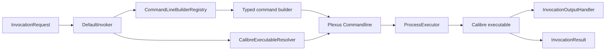

# Calibre Invoker Complete Functionality Design

**Date:** 2026-08-19

**Status:** Approved requirements baseline derived from `.omx/plans/calibre-invoker-complete-functionality-plan.md`. This document is the sole specification source for this change; do not create a parallel OpenSpec or Spec Kit change.

## Goal

Turn `calibre-invoker` into a complete Java 17 library in which every checked-in Calibre request type reaches the correct Calibre executable through `DefaultInvoker.execute()`, while preserving existing public API compatibility and establishing deterministic cross-platform tests.

## Scope

The supported command matrix is:

| Command | Current request | Current builder | Target status |
|---|---|---|---|
| `web2disk` | `Web2diskInvocationRequest` | Present | Repair and retain |
| `fetch-ebook-metadata` | `FetchEbookMetadataInvocationRequest` | Present | Repair and connect |
| `lrf2lrs` | `Lrf2lrsInvocationRequest` | Present | Repair and connect |
| `lrs2lrf` | `Lrs2lrfInvocationRequest` | Present | Repair and connect |
| `lrfviewer` | `LrfviewerInvocationRequest` | Present | Repair and connect |
| `ebook-convert` | `DefaultEbookConvertInvocationRequest` | Missing | Add typed contract and builder |
| `ebook-edit` | `DefaultEbookEditInvocationRequest` | Missing | Add typed contract and builder |
| `ebook-meta` | `DefaultEbookMetaInvocationRequest` | Missing | Add typed contract and builder |
| `ebook-polish` | `DefaultEbookPolishInvocationRequest` | Missing | Add typed contract and builder |
| `ebook-viewer` | `DefaultEbookViewerInvocationRequest` | Missing | Add typed contract and builder |

Calibre 9.11/9.12 documentation still lists all ten commands. LRF commands remain supported as compatibility commands. Dynamic `ebook-convert` plugin options are not exhaustively modeled; callers receive an ordered additional-arguments escape hatch.

Out of scope: Calibre GUI automation, DRM handling, database/library management, HTTP services, distributed execution, and remote Calibre nodes.

## Constraints

- Java 17 and Maven remain the build baseline.
- Existing public types and method descriptors remain binary compatible.
- Production logging uses SLF4J; existing `InvokerLogger` implementations remain as compatibility adapters.
- Object null checks use `Objects.isNull/nonNull`; string checks use imported `StringUtils`.
- Production code uses no wildcard imports.
- Command arguments are passed as tokens, never concatenated into a shell command.
- No Git worktree may be created.
- Unit tests must not require network access or a local Calibre installation.

## Architecture



### CommandLineBuilderRegistry

`CommandLineBuilderRegistry` owns the request-interface-to-builder-factory mapping. It returns a fresh builder per invocation, rejects duplicate registrations, and throws a checked configuration exception for unsupported requests. `DefaultInvoker` retains its protected `getCommandLineBuilder` extension point but delegates the default behavior to the registry.

### CalibreExecutableResolver

`CalibreExecutableResolver` resolves a tool name with this precedence:

1. request-level `calibreHome`;
2. invoker-level `calibreHome`;
3. JVM property `calibre.home`;
4. environment `CALIBRE_HOME`;
5. executable name resolved through `PATH`;
6. macOS `/Applications/calibre.app/Contents/MacOS` candidate.

The resolver receives environment/system-property/file probes through constructor dependencies so unit tests can simulate Windows, macOS, and Linux without mutating the host.

### ProcessExecutor

`ProcessExecutor` isolates the static Plexus execution call:

```java
public interface ProcessExecutor {
    int execute(Commandline commandline,
            InvocationOutputHandler outputHandler,
            InvocationOutputHandler errorHandler) throws CommandLineException;
}
```

`PlexusProcessExecutor` is the production implementation. Tests inject a recording fake and assert executable, token order, environment, working directory, handlers, exit code, and exceptions.

### Typed command builders

`AbstractCommandLineBuilder` retains common environment, properties, goals, verbose, working-directory, logger, and executable plumbing. Each concrete builder validates exactly one request interface and emits only command-specific arguments. Builders never silently ignore a mismatched request.

## Request Contracts

Existing malformed boolean fields that represent string values are replaced by correctly typed fields while retaining deprecated legacy setters where binary compatibility requires them.

- `FetchEbookMetadataInvocationRequest`: `String title`, `String authors`, `String isbn`, repeatable `List<String> allowedPlugins`, repeatable identifiers, optional cover, OPF flag, positive timeout.
- `EbookConvertInvocationRequest`: required input/output files plus ordered additional arguments.
- `EbookEditInvocationRequest`: required ebook file plus ordered additional arguments.
- `EbookMetaInvocationRequest`: required ebook file; typed metadata strings/files and repeatable identifiers.
- `EbookPolishInvocationRequest`: required input/output files and typed boolean polish operations.
- `EbookViewerInvocationRequest`: optional ebook file when continue-reading is true; full-screen, new-instance, raise-window, open-at, and detach flags.

All fluent methods return the same request instance.

## Invocation Flow

1. Reject a null request with `CalibreInvocationException`.
2. Resolve one builder from the registry.
3. Calculate effective configuration. Request handler and request Calibre Home override invoker values.
4. Resolve the executable and build a tokenized `Commandline`.
5. Apply environment and working directory.
6. Execute through `ProcessExecutor`.
7. Return a result for exit code zero or non-zero.
8. Wrap configuration failures in `CalibreInvocationException`; record process-start `CommandLineException` in `InvocationResult` for compatibility.

`web2disk.timeout` remains a network response timeout. It is not reused as a process timeout.

## Error Semantics

| Condition | Result |
|---|---|
| Null/unsupported request | `CalibreInvocationException` with request type |
| Missing executable | `CalibreInvocationException` with searched sources, no secret values |
| Invalid command option | `CalibreInvocationException` naming the invalid field |
| Process start failure | `InvocationResult.executionException` |
| Calibre non-zero exit | `InvocationResult.exitCode` preserves the value |
| Success | exit code `0`, no execution exception |

## Logging and Security

Core classes log through SLF4J. Command name, duration, exit code, and working directory may be logged. URL user-info, passwords, tokens, proxy credentials, and values of custom environment variables are redacted. Output handlers stream by default; any capturing handler has a byte limit.

## Testing

### Unit

- Exact argument-token tests for every builder.
- Resolver precedence and OS behavior.
- Registry completeness and duplicate rejection.
- Null, unsupported request, configuration validation, and fluent setters.
- Logger redaction and bounded output.

### Integration without Calibre

- Recording `ProcessExecutor` verifies the full `DefaultInvoker` path.
- Temporary executable scripts verify environment and working-directory propagation.
- Tests run offline on Ubuntu, Windows, and macOS.

### Real Calibre

- Maven Failsafe profile executes small local fixtures for convert/meta/polish.
- GUI and network commands run only in manual or scheduled workflows.
- The workflow records `calibre --version` and command `--help` snapshots.

## Delivery Gates

- All ten request families route through `DefaultInvoker`.
- No NPE/ClassCastException for public invalid input.
- Core invoker, resolver, registry, and builder packages reach at least 90% line and branch coverage with enforcement enabled.
- Ubuntu, Windows, and macOS JDK 17 CI pass.
- Public API compatibility check passes or reports only approved additions/deprecations.
- README/Javadoc support claims match automated evidence.

## Alternatives Considered

### Extend the current instanceof chain

Rejected because ten branches duplicate construction policy, do not detect duplicate/missing mappings, and make extension tests cumbersome.

### ServiceLoader plugin system

Deferred because it introduces deployment and class-loader complexity not required by the current single-artifact library.

### Registry plus focused collaborators

Selected because it preserves the current facade and builders while isolating routing, executable resolution, and process execution for deterministic tests.
